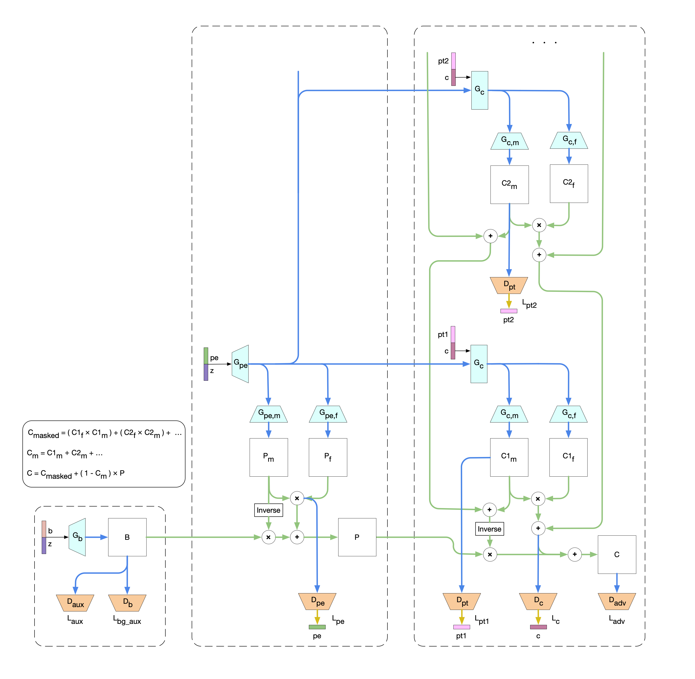

**Version 2.6.1.1.2**

Feed part final image through discriminator

added soft constraints (concentration loss; separation loss, parent child similarity loss, equivariance loss) 

implemented mask incomplete loss:  
using new discriminator; 
discriminator uses complete image as real sample; 

